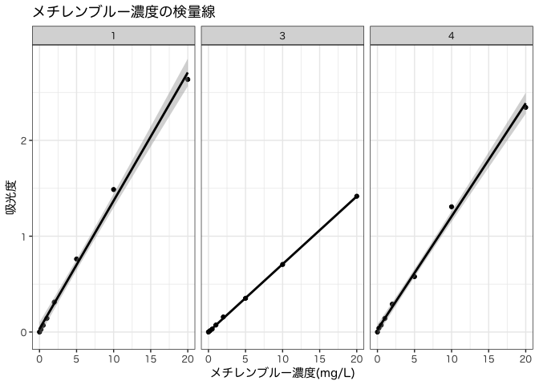
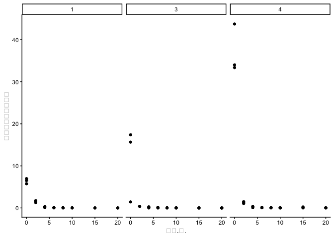

# 浄水処理実験 実験レポート
03250114 大隅伸明

<!--# ここに表紙用のraw latexコード -->

## 目的

上水実験課題では以下の項目を扱い、浄水処理の物理化学的な原理について定性的・定量的な両面から理解を深めることを目的とする。

1.  オゾンによる有機物分解

2.  a

3.  a

4.  凝集沈殿における最適条件の決定

5.  消毒

    1.  塩素消毒

    2.  紫外線消毒

## 課題A オゾンによる有機物分解

### 実験概要

概要をここに書いていく。。

### 結果

まず、メチレンブルー濃度算出に用いる検量線を作成した。各班の実測値は以下の通り。

| メチレンブルー濃度.mg.L. | 吸光度 |
|--------------------------|--------|
| 3                        |        |
| 0.0                      | 0.000  |
| 0.2                      | 0.013  |
| 0.5                      | 0.031  |
| 1.0                      | 0.073  |
| 2.0                      | 0.157  |
| 5.0                      | 0.352  |
| 10.0                     | 0.705  |
| 20.0                     | 1.417  |
| 1                        |        |
| 0.0                      | 0.000  |
| 0.2                      | 0.028  |
| 0.5                      | 0.070  |
| 1.0                      | 0.143  |
| 2.0                      | 0.312  |
| 5.0                      | 0.762  |
| 10.0                     | 1.487  |
| 20.0                     | 2.636  |
| 4                        |        |
| 0.0                      | 0.000  |
| 0.2                      | 0.041  |
| 0.5                      | 0.072  |
| 1.0                      | 0.142  |
| 2.0                      | 0.291  |
| 5.0                      | 0.578  |
| 10.0                     | 1.307  |
| 20.0                     | 2.344  |

<!--# ここの表現もうちょっと洗練させたいなぁ。。 -->

上記のデータを用いて最小二乗法で検量線を作成したところ、今回採用した希釈段階の全域に渡ってデータは線形な変化であることを確認することができた。

    `geom_smooth()` using formula = 'y ~ x'

上記の検量線を用いて、各時刻でのメチレンブルー濃度の変化を導出した。pH・オゾン濃度・TOC濃度の実測値と合わせ、以下に結果を示す。

<!--# ここの部分の計算は完全に嘘！修正してから出す！(このコメントは修正したら消す) -->

| 時間.分.       | 吸光度 | 吸光度_希釈 | pH    | O3_conc | メチレンブルー濃度 | TOC濃度 |
|----------------|--------|-------------|-------|---------|--------------------|---------|
| 3 - 酸性       |        |             |       |         |                    |         |
| 0              | 0.478  | 3           | 2.17  | 1.06    | 1                  | NA      |
| 2              | NA     | 2           | NA    | NA      | 1                  | NA      |
| 4              | 0.001  | 1           | NA    | NA      | 1                  | NA      |
| 6              | -0.001 | 1           | NA    | NA      | 1                  | NA      |
| 8              | 0.001  | 1           | NA    | NA      | 1                  | NA      |
| 10             | -0.004 | 1           | NA    | NA      | 1                  | NA      |
| 15             | -0.007 | 1           | NA    | NA      | 1                  | NA      |
| 20             | -0.003 | 1           | 2.11  | 0.83    | 1                  | NA      |
| 3 - 中性       |        |             |       |         |                    |         |
| 0              | 5.799  | 3           | 7.00  | 1.06    | 1                  | NA      |
| 2              | 0.354  | 1           | NA    | NA      | 1                  | NA      |
| 4              | 0.153  | 1           | NA    | NA      | 1                  | NA      |
| 6              | 0.025  | 1           | NA    | NA      | 1                  | NA      |
| 8              | -0.001 | 1           | NA    | NA      | 1                  | NA      |
| 10             | 0.002  | 1           | NA    | NA      | 1                  | NA      |
| 15             | -0.005 | 1           | NA    | NA      | 1                  | NA      |
| 20             | -0.002 | 1           | 7.01  | 0.03    | 1                  | NA      |
| 3 - アルカリ性 |        |             |       |         |                    |         |
| 0              | 5.217  | 3           | 12.25 | 1.06    | 1                  | NA      |
| 2              | 0.379  | 1           | NA    | NA      | 1                  | NA      |
| 4              | 0.256  | 1           | NA    | NA      | 1                  | NA      |
| 6              | 0.140  | 1           | NA    | NA      | 1                  | NA      |
| 8              | 0.068  | 1           | NA    | NA      | 1                  | NA      |
| 10             | 0.053  | 1           | NA    | NA      | 1                  | NA      |
| 15             | 0.017  | 1           | NA    | NA      | 1                  | NA      |
| 20             | 0.005  | 1           | 11.88 | 0.00    | 1                  | NA      |
| 1 - 酸性       |        |             |       |         |                    |         |
| 0              | 1.743  | 4           | 2.51  | 0.54    | 1                  | NA      |
| 2              | 1.287  | 1           | NA    | NA      | 1                  | NA      |
| 4              | 0.317  | 1           | NA    | NA      | 1                  | NA      |
| 6              | 0.065  | 1           | NA    | NA      | 1                  | NA      |
| 8              | 0.019  | 1           | NA    | NA      | 1                  | NA      |
| 10             | 0.007  | 1           | NA    | NA      | 1                  | NA      |
| 15             | 0.007  | 1           | NA    | NA      | 1                  | NA      |
| 20             | 0.007  | 1           | 2.53  | 0.10    | 1                  | NA      |
| 1 - 中性       |        |             |       |         |                    |         |
| 0              | 1.439  | 4           | 7.10  | 0.54    | 1                  | NA      |
| 2              | 1.627  | 1           | NA    | NA      | 1                  | NA      |
| 4              | 0.087  | 1           | NA    | NA      | 1                  | NA      |
| 6              | 0.017  | 1           | NA    | NA      | 1                  | NA      |
| 8              | 0.011  | 1           | NA    | NA      | 1                  | NA      |
| 10             | 0.005  | 1           | NA    | NA      | 1                  | NA      |
| 15             | 0.001  | 1           | NA    | NA      | 1                  | NA      |
| 20             | 0.000  | 1           | 6.97  | 0.02    | 1                  | NA      |
| 1 - アルカリ性 |        |             |       |         |                    |         |
| 0              | 1.627  | 4           | 12.25 | 0.54    | 1                  | NA      |
| 2              | 1.727  | 1           | NA    | NA      | 1                  | NA      |
| 4              | 0.252  | 1           | NA    | NA      | 1                  | NA      |
| 6              | 0.107  | 1           | NA    | NA      | 1                  | NA      |
| 8              | 0.073  | 1           | NA    | NA      | 1                  | NA      |
| 10             | 0.050  | 1           | NA    | NA      | 1                  | NA      |
| 15             | 0.011  | 1           | NA    | NA      | 1                  | NA      |
| 20             | 0.007  | 1           | 12.08 | 0.01    | 1                  | NA      |
| 4 - 酸性       |        |             |       |         |                    |         |
| 0              | 8.500  | 4           | 2.43  | 1.06    | 1                  | NA      |
| 2              | 1.498  | 1           | NA    | NA      | 1                  | NA      |
| 4              | 0.341  | 1           | NA    | NA      | 1                  | NA      |
| 6              | 0.091  | 1           | NA    | NA      | 1                  | NA      |
| 8              | 0.023  | 1           | NA    | NA      | 1                  | NA      |
| 10             | 0.011  | 1           | NA    | NA      | 1                  | NA      |
| 15             | 0.009  | 1           | NA    | NA      | 1                  | NA      |
| 20             | 0.008  | 1           | 2.41  | 0.35    | 1                  | NA      |
| 4 - 中性       |        |             |       |         |                    |         |
| 0              | 8.340  | 4           | 7.07  | 1.06    | 1                  | NA      |
| 2              | 1.277  | 1           | NA    | NA      | 1                  | NA      |
| 4              | 0.070  | 1           | NA    | NA      | 1                  | NA      |
| 6              | 0.038  | 1           | NA    | NA      | 1                  | NA      |
| 8              | 0.026  | 1           | NA    | NA      | 1                  | NA      |
| 10             | 0.014  | 1           | NA    | NA      | 1                  | NA      |
| 15             | 0.234  | 1           | NA    | NA      | 1                  | NA      |
| 20             | 0.015  | 1           | 7.03  | 0.17    | 1                  | NA      |
| 4 - アルカリ性 |        |             |       |         |                    |         |
| 0              | 8.745  | 5           | 12.30 | 1.06    | 1                  | NA      |
| 2              | 1.055  | 1           | NA    | NA      | 1                  | NA      |
| 4              | 0.307  | 1           | NA    | NA      | 1                  | NA      |
| 6              | 0.121  | 1           | NA    | NA      | 1                  | NA      |
| 8              | 0.088  | 1           | NA    | NA      | 1                  | NA      |
| 10             | 0.052  | 1           | NA    | NA      | 1                  | NA      |
| 15             | 0.053  | 1           | NA    | NA      | 1                  | NA      |
| 20             | 0.058  | 1           | 12.13 | 0.07    | 1                  | NA      |

上記の検量線を用いてメチレンブルー濃度を計算し、時間変化を図示すると以下のようになった。

### 考察

## 課題B

### 実験概要

### 結果

### 考察

## 課題C

### 実験概要

### 結果

### 考察

## 課題D 凝集沈殿における最適条件の決定

### 実験概要

概要をここに書く。

### 結果

まず、二種類の水試料について、凝集剤の濃度を変化させて凝集剤の最適添加量を求めた。実験結果は以下のようになった。

| 凝集剤濃度 | 濁度  | pH.後. | 水温 | mアルカリ度 |
|------------|-------|--------|------|-------------|
| 三四郎     |       |        |      |             |
| 0          | 6.508 | 7.12   | 11.6 | 4.01        |
| 10         | 6.512 | 7.18   | 11.6 | 3.86        |
| 20         | 4.281 | 7.16   | 11.6 | 3.63        |
| 50         | 1.037 | 7.10   | 11.6 | 3.14        |
| 75         | 1.175 | 6.40   | 11.6 | 2.64        |
| 100        | 2.362 | 6.44   | 11.6 | 2.19        |
| カオリン   |       |        |      |             |
| 0          | 3.574 | 6.99   | 20.7 | 1.79        |
| 10         | 3.630 | 7.17   | 20.7 | 1.62        |
| 20         | 2.134 | 7.00   | 20.7 | 1.48        |
| 50         | 3.982 | 6.87   | 20.7 | 1.09        |
| 75         | 5.790 | 6.48   | 20.7 | 0.47        |
| 100        | 6.949 | 5.90   | 20.7 | 0.13        |

<!--# 何アルカリ度だっけ? -->

また、m-アルカリ度

最適な凝集剤添加条件は以下のように求められた。

<!--# 全班一緒ならmax()で数値埋め込み。そうでなければ表を作る。 -->

次に、上記で求めた最適量の凝集剤を添加した上で、pHを酸性~アルカリ性の数段階で変化場合の各化学指標の経時変化を以下に示す。

| 理論pH   | pH前  | pH後  | 濁度  | 滴定_前 | 滴定_後 | ゼータ電位 | 水温 | 滴定試料量 | mアルカリ度 |
|----------|-------|-------|-------|---------|---------|------------|------|------------|-------------|
| 三四郎   |       |       |       |         |         |            |      |            |             |
| pH3      | 3.33  | 3.41  | 5.414 | NA      | NA      | -9.081     | NA   | 50         | NA          |
| pH5      | 5.57  | 4.96  | 1.649 | NA      | NA      | -9.213     | NA   | 50         | NA          |
| pH7      | 7.66  | 7.29  | 0.662 | 3.51    | 0.42    | -9.921     | NA   | 50         | 3.09        |
| pH9      | 8.88  | 7.62  | 4.241 | 7.08    | 3.51    | -10.440    | NA   | 50         | 3.57        |
| pH11     | 10.47 | 9.89  | 1.448 | 13.15   | 7.08    | -13.930    | NA   | 50         | 6.07        |
| カオリン |       |       |       |         |         |            |      |            |             |
| pH3      | 3.88  | 3.48  | 3.679 | NA      | NA      | -12.770    | 19.3 | 50         | NA          |
| pH5      | 4.57  | 4.55  | 3.796 | NA      | NA      | -18.820    | 19.3 | 50         | NA          |
| pH7      | 7.10  | 7.23  | 3.241 | 14.61   | 13.15   | -10.390    | 19.3 | 50         | 1.46        |
| pH9      | 8.55  | 7.73  | 2.088 | 16.29   | 14.61   | -17.640    | 19.3 | 50         | 1.68        |
| pH11     | 10.67 | 10.48 | 3.830 | 21.42   | 16.29   | -15.340    | 19.3 | 50         | 5.13        |

### 考察

考察をここに書く

## 課題E 消毒

### 実験概要

### 結果

### 考察
